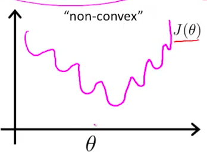
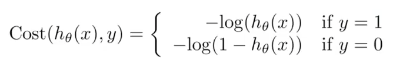
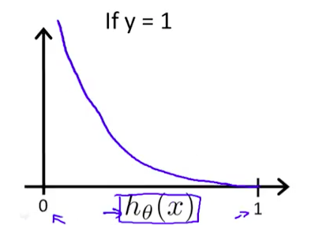
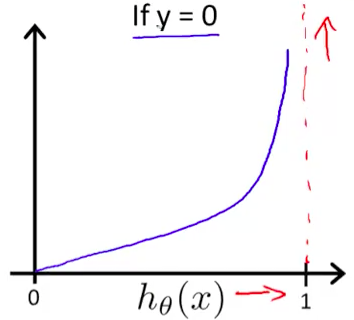

1.代价函数
我們不可以繼續用之前Linear Regression的cost function，因为这样会使得函数输出值变得很抖动，sigmoid的函數平方項將會造成一個 unconvex的函數圖形。這意味著，我們很有可能走到一個距離global optimal solution還很遠的地方就停下來了(local optimal solution)，正如下圖所示因此逻辑回归的代价函数稍作调整

因此我们需要一个新的代价函数，如下图所示：

這個函數的精華就是當預測失敗的時候，我們要讓預測誤差變得很大,並隨著預測數字離正確答案越近，預測誤差會漸漸趨近於0,如下图所示：
 

