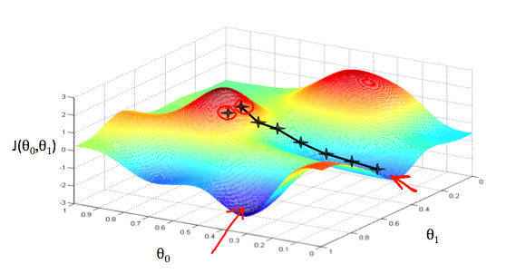

吴恩达机器学习第一周 第二部分
1.损失函数
We can measure the accuracy of our hypothesis function by using a cost function损失函数是用来测量假定的函数的正确性的，公式如下：

$$J(\theta_0,\theta_1)=\frac{1}{2m}\sum_{i=1}^{m}(h_\theta(x_i)-y_i)^2$$

引入损失函数的目的是，计算$$\theta_0,\theta_1$$,使得h$$_\theta(x)$$最接近于训练集中的y值，也即$$J(\theta)=0$$
2.梯度下降法
梯度下降法Gradient Descent的目的是确立损失函数中的参数，使得损失函数最小，也就是$$h_\theta(x)$$函数结果最接近y。设定不同的$$\theta_0,\theta_1$$,对于其组成的假设，其损失函数值如下图所示
 
$$\theta_0$$在x轴，$$\theta_1$$在y轴，损失函数结果在z轴，如图中所示，当位于图中最低点时，损失函数结果最小，为了找到最小损失函数结果的参数，使用“导数”，对于所有参数$$\theta_j$$,迭代使用如下方法即可
$$\theta_j:=\theta_j-\alpha\frac{\partial}{\partial \theta_j}J(\theta_0,\theta_1)$$
j=0,1,每次迭代都需要同时更新每一个$$\theta$$,如下图所示

3.