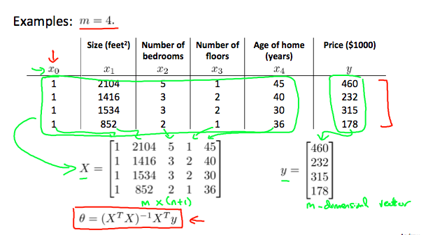

吴恩达的机器学习 第二周3
1. Feature Scaling

We can speed up gradient descent by having each of our input values in roughly the same range.
目标：
$$-1\leq x_{(i)} \leq 1$$
方法：
 feature scaling and mean normalization
** Feature scaling** involves dividing the input values by the range (i.e. the maximum value minus the minimum value) of the input variable

**Mean normalization** involves subtracting the average value for an input variable from the values for that input variable resulting in a new average value for the input variable of just zero.

$$x_i:=\frac{x_i-u_i}{s_i}$$
$$μ_i$$is the average of all the values for feature (i) and $$s_i$$ is the range of values (max - min) or $$s_i$$ is the standard deviation.

2. 关于 $$\alpha$$的选取
Make a plot with number of iterations on the x-axis. Now plot the cost function, J(θ) over the number of iterations of gradient descent. If J(θ) ever increases, then you probably need to decrease α

If $$\alpha$$ is too small: slow convergence.
If $$\alpha$$ is too large: may not decrease on every iteration and thus may not converge.

3.Features and Polynomial Regression
Our hypothesis function need not be linear (a straight line) if that does not fit the data well.

We can change the behavior or curve of our hypothesis function by making it a quadratic, cubic or square root function (or any other form).
For example, if our hypothesis function is $$h_\theta(x)=\theta_0+\theta_1x_1$$	​	  then we can create additional features based on $$x_1$$ to get the quadratic function $$h_\theta(x)=\theta_0+\theta_1x_1+\theta_2x_1^2$$

4 Normal Equation
Gradient descent gives one way of minimizing J .In the "Normal Equation" method, we will minimize J by explicitly taking its derivatives with respect to the θj ’s, and setting them to zero. This allows us to find the optimum theta without iteration. The normal equation formula is given below:
$$\theta=(X^TX)^{-1}X^Ty$$
如下图所示：

