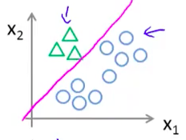
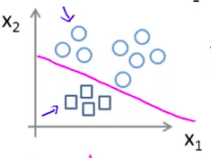
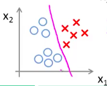

1.如果不是二元分类，而是多类别分类，做法是將除了目前處理的類別之外的類別都視為同個群體。如下图：

我們要區分出綠色三角形時，要把藍色正方形跟紅色叉叉視為是一個群體來劃分(得到一個hypothsis)：

然後分辨出藍色正方形(再得到一個hypothsis)：

分辨紅色叉叉(又得到一個hypothsis)

最後我們可以得到三條可以清楚劃分不同類別的線(Decision Boundary)
也就是三種不同的hypothesis
而今天若是新增一組資料，我們要怎麼分類呢？
做法：將這組資料帶入不同的hypothesis，以上例而言，我們應該會有3個不同的hypothesis：三角形、正方形、叉叉
然後會得到這組資料是三角形、正方形、叉叉的三種不同機率
最後再根據最大的機率來分類出其最有可能的圖形