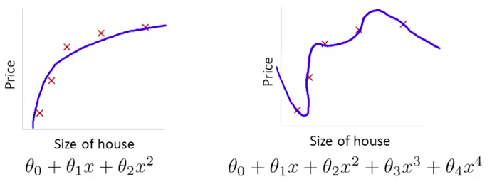

1.过拟合 overfitting
就是结果太过逼近样本数的结果

“If we have too many features, the learned hypothesis may fit the training set very well (J(θ)=0), but fail to generalize to new examples(Predictions on new examples)”

那我們要怎麼解決Overfitting的問題呢？

有幾種做法：

1. 降低features的數量：人工選擇、model selection algorithm

2. Regularization：維持現有的features，但是降低部分不重要feature的影響力。這對於有著許多feature的hypothesis很有幫助
如下图：
 
左方為適當的模型，右方為Overfitting，我們可以發現主要的問題是在加了θ3跟θ4之後出現了overfitting的問題
那假設我們將θ3跟θ4的影響降到最低呢(讓其逼近於0)？
