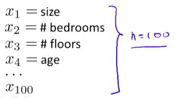

吴恩达机器学习第四周
神经网络

1.起源：神经网络是一个很老的思路，但是流行了很长一段时间。之前学习过了监督学习的两个类别：线性回归和逻辑回归，他们都有一个共同的特点，就是用“假设方程”来解决参数问题，但是在复杂的非线性系统(complex non-linear Hypothesis)情况下解决效率很低。
比如房价判断可能要考虑100个features(如下图) ，而且只考虑2阶因素，那可能会有5000个多项式($$100+C_{100}^2$$)，而如果考虑三阶、多阶因素，多项式会指数级别增长，所以得出这个结论：
  **當feature一多的時候，會使得先前提到的：linear regression,logistic regression...等的計算成本指數上升**

换一个例子，如果通过图片来判断是否包含“汽车”这个物体，如果图片是50*50像素的，那么feature就是2500，如果是RGB彩色图片，那feature就是7500，如果是一个100*100像素的灰度图片，考虑使用2阶因素，那么多项式的个数是 $$100*100+C_{100*100}^2 \approx 5*10^7$$个！